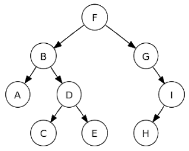

# Tree

Tree is a non-linear Data Structure and order of Element is not important.



#### Terminology

- Edge: Refers to link b/w two nodes
- Leaf Node: Node with no Children eg.[C, E, H]
- Root Node is at Level 0.
- **Depth** of a Node is the length of Path from **root** to the **Node**
  eg. Depth of D is 2 (F->B->D).
- **Height** of a Node is the length of Path from that node to the deepest node.
  eg. Height of B is (B->D->E) 2.
- **Binary Tree**: If in a Tree, every node has 0, 1, 2 child. Then it is called binary Tree.
  1.  **Strict Binary Tree**: Every node has 2 children is Strict Binary Tree
  2.  **Full Binary Tree**: If each node has exactly two children. The number of nodes in full
      binary Tree is 2^h
  3.  Height of complete Binary Tree range from 2^h to 2^(h+1) - 1;
- **Size**: Size of Node is the number of descendants it has including itself
  e.g Size of B is 5

#### Application

- Expression trees are used in compilers
- Huffman coding trees are used in data compression Algorithm
- Binary Search Tree supports (search, insert, deletion) in log(n) time.
- Priority Queue supports search and deletion of min and max in log(n) on worst case.

#### Tree Traversal

##### 1. Post Order Traversal

1. Recursive:

   ```java
     public void printPostorder(Node<E> node) {
       if (node == null) {
         return;
       }
       printPostorder(node.left);
       printPostorder(node.right);
       System.out.print(node.data + " ");
     }
   ```

2. Iterative
   - Create a stack and a node variable name previousNode
   - if root is null return
   - push root to the stack
   - Now iterate over the Stack while it is not Empty
   - Pop an Element from the Stack and check
     if it is not a childNode
     ```java
       /**
          if node right is not null and previousNode is right node of current thus right is traversed we need to print parent
          elseif node right is null then check if previousNode is left of currentNode then print the Parent Node
        */
       if((currentNode.right != null && currentNode.right == previousNode)
                               || (currentNode.right == null && currentNode.left == previousNode))
     ```
     else if node is childNode
     print the node
     previousNode = currentNode

##### 2. In Order Traversal

1. Recursive
   ```java
    public void printPreOrder(Node<E> node) {
        /* If root is null, return else print
         * in order specified above */
        if (node == null) {
          return;
        }
        System.out.print(node.data + " ");
        printPreOrder(node.left);
        printPreOrder(node.right);
    }
   ```
